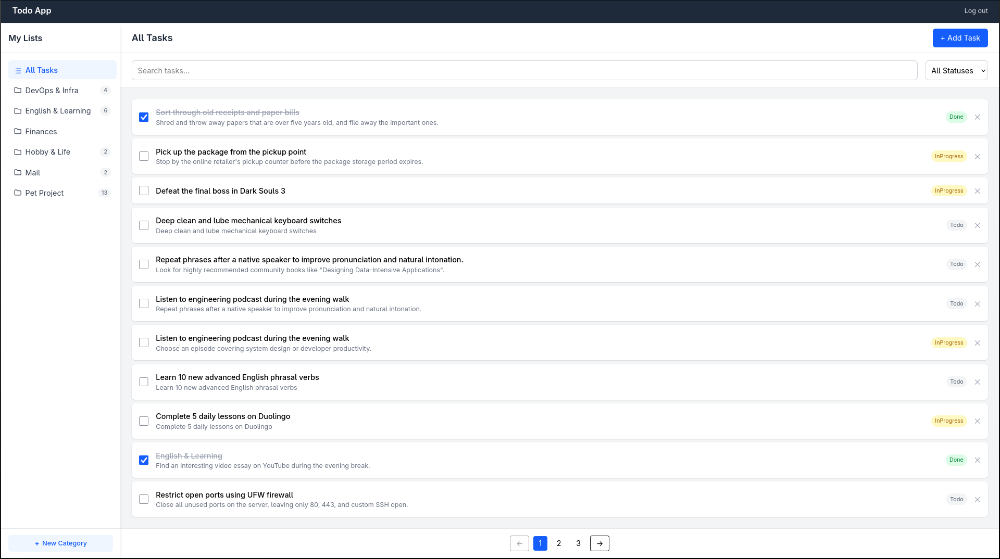
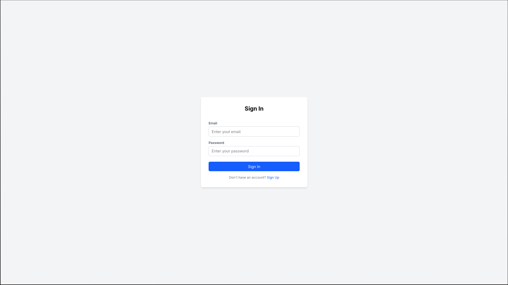
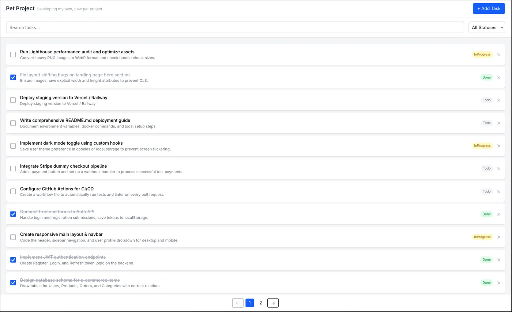
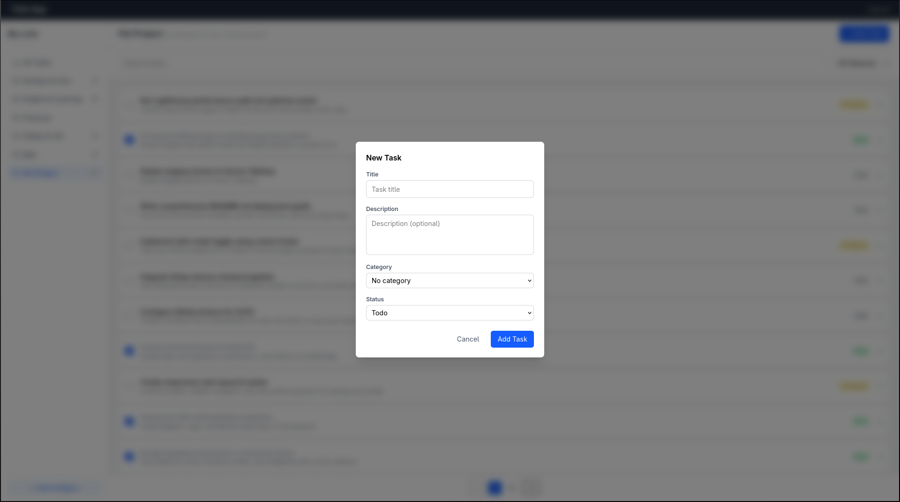
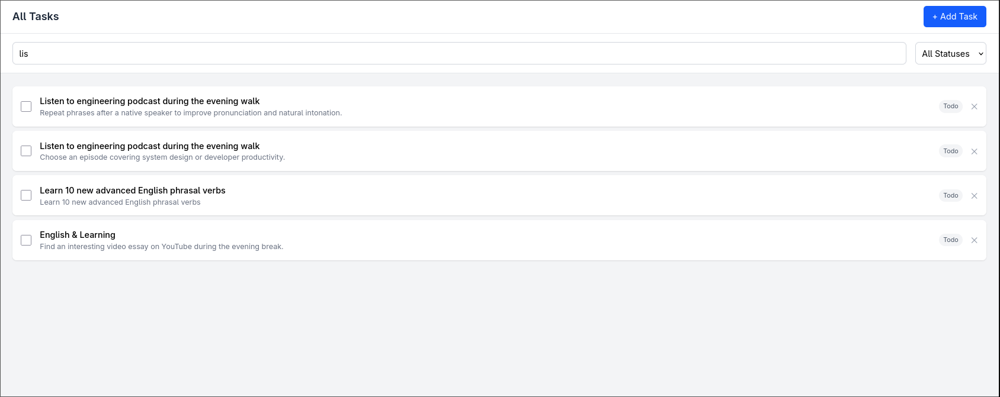

# TodoApp


A full-stack To-Do application built with **.NET 10** and **Angular**, featuring JWT authentication, category-based task management, and role-based access control.



## Tech Stack

**Backend:**
* **.NET 10, ASP.NET Core Web API**
* **Entity Framework Core** — code-first migrations, per-entity configuration classes
* **SQL Server** — containerized via Docker
* **JWT Authentication** — access + refresh token flow with role-based authorization
* **FluentValidation** — request validation
* **AutoMapper** — entity ↔ DTO mapping
* **Repository Pattern + Unit of Work** — data access abstraction
* **Dependency Injection** — built-in .NET DI container

**Frontend:**
* **Angular 19** — standalone components, signals, OnPush change detection
* **Tailwind CSS** — utility-first styling
* **RxJS** — reactive state management with BehaviorSubject

## Architecture

The backend follows an **N-Tier architecture** with 4 conceptual layers:

* **Controllers** — HTTP endpoints, request/response handling (TA.API)
* **Services** — Business logic implementation (TA.BLL)
* **Interfaces** — Abstraction contracts for services and repositories (TA.BLL / TA.DAL)
* **Data Access** — EF Core repositories, Unit of Work, DbContext (TA.DAL)

## Roles & Permissions

| Role | Tasks | Categories | Users |
| :--- | :--- | :--- | :--- |
| **User** | CRUD own tasks | CRUD own categories | — |
| **Administrator** | View all tasks | View all categories | Full access |

## Features

* JWT authentication — login, register, logout with refresh token rotation
* Task management — create, view, edit, delete with status tracking (Todo / InProgress / Done)
* Categories — create, edit, delete with task filtering by category
* Search — real-time search with debounce
* Pagination — server-side pagination
* Role-based access control

## Screenshots

### Login


### Tasks


### Create Task


### Tasks Search


## Getting Started

### Prerequisites
* [.NET 10 SDK](https://dotnet.microsoft.com/download/dotnet/10.0)
* [Node.js 20+](https://nodejs.org/)
* [Docker](https://www.docker.com/) / Docker Compose

### 1. Clone the repository
```bash
git clone https://github.com/Am0rr/Todo-app
cd Todo-app
```

### 2. Configure environment variables

Copy `.env.example` to `.env` and fill in the values:

```env
DB_HOST=localhost
DB_PORT=1433
MSSQL_SA_PASSWORD=YourStrongPassword123!
DB_NAME=TodoAppDB

Jwt__SecureKey=your-secret-key-min-32-characters-long
Jwt__Issuer=Backend
Jwt__Audience=Frontend
Jwt__AccessTokenLifetimeInMinutes=15
Jwt__RefreshTokenLifetimeInDays=7
```

> **Note:** The API automatically constructs the Connection String from `DB_*` variables.
> `MSSQL_SA_PASSWORD` must satisfy SQL Server complexity policy (uppercase, lowercase, digit, special character, 8+ characters).

### 3. Start the database

```bash
docker compose up -d
```

### 4. Run the backend

```bash
cd backend/TA.API
dotnet run
```

API will be available at: `http://localhost:5215`

On first launch, EF Core migrations are applied automatically — no manual setup needed.

### 5. Run the frontend

```bash
cd frontend
npm install
ng serve
```

App will be available at: `http://localhost:4200`

### 6. Create an Administrator

Register a user via the app, then promote them in the database:

```sql
UPDATE Users SET Role = 'Administrator' WHERE Username = 'your-username';
```

## API Endpoints

### Auth (`/api/auth`) — Public

| Method | Endpoint | Description |
| --- | --- | --- |
| `POST` | `/register` | Register a new user |
| `POST` | `/login` | Authenticate and receive tokens |
| `POST` | `/refresh` | Refresh access token |
| `POST` | `/revoke` | Revoke refresh token |

### Tasks (`/api/tasks`)

| Method | Endpoint | Description |
| --- | --- | --- |
| `GET` | `/` | Get all tasks |
| `GET` | `/{id}` | Get task by ID |
| `GET` | `/paged` | Filtered and paginated task list |
| `POST` | `/` | Create a task |
| `PATCH` | `/{id}` | Update a task |
| `DELETE` | `/{id}` | Delete a task |

### Categories (`/api/categories`)

| Method | Endpoint | Description |
| --- | --- | --- |
| `GET` | `/` | Get all categories |
| `GET` | `/{id}` | Get category by ID |
| `POST` | `/` | Create a category |
| `PATCH` | `/{id}` | Update a category |
| `DELETE` | `/{id}` | Delete a category |

### Users (`/api/users`) — Administrator only

| Method | Endpoint | Description |
| --- | --- | --- |
| `GET` | `/` | List all users |
| `GET` | `/{id}` | Get user by ID |
| `GET` | `/email?email=` | Get user by email |
| `PATCH` | `/{id}` | Update a user |
| `DELETE` | `/{id}` | Delete a user |